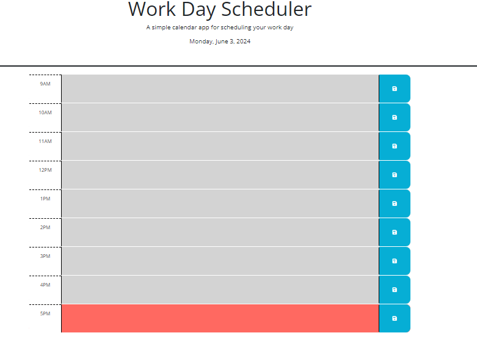

# Work-Day-Schedular

# Built With 
- HTML5
- CSS3
- Bootstrap
- JavaScript
- jQuery
- Dayjs
- Font Awesome

# Description

This application can be used to track and save events to do over a 9-5 workday. Current day is displayed at the top of the page. Their are timeblocks for each hour and are color coded by past, present, and future. A user can type an event in the timeblock and can save by the save button, and the event will be stored in local storage.

# Installation

git clone https://github.com/BPouliot1/Code-Quiz.git

# Usage

Open index.html file and start adding events

# Visuals

Live Website https://bpouliot1.github.io/Work-Day-Schedular/

# References 

AdvancedFormat plugin: https://day.js.org/docs/en/plugin/advanced-format
